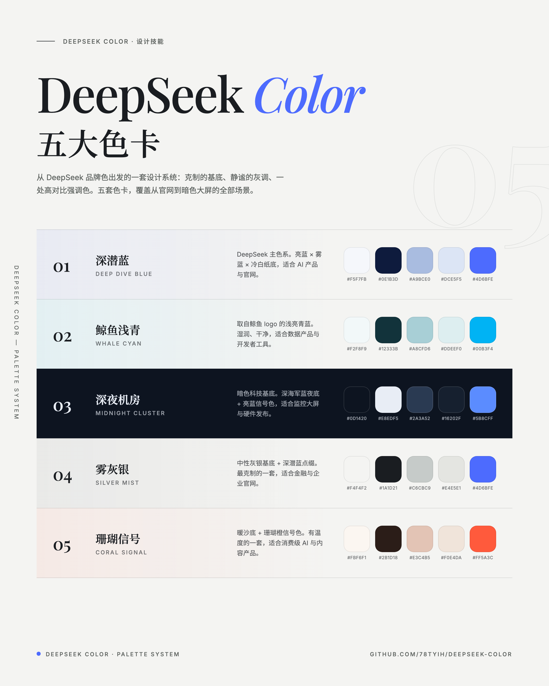
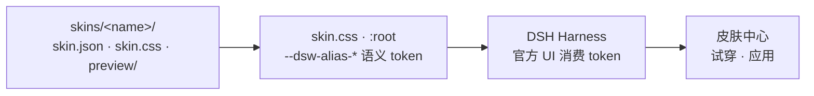

# DeepSeek Color — DSH 皮肤包

> 给 DeepSeek Harness 用户：五套**纯 token** 皮肤，把 DeepSeek Color 五大色卡带进桌面端 / Web UI。零补丁、零脚本、零背景媒体——皮肤体系里最安全的 L1 层。

**[交互展示页](https://78tyih.github.io/dsh-deepseek-color/showcase.html)**（ZH/EN × 日/夜，五套皮肤实时试穿）· [主仓库设计系统](https://github.com/78tyih/deepseek-color)

| 类型 | 状态 | 入口 |
|---|---|---|
| Token 皮肤包（CSS 变量重映射） | 可用 · 5 套皮肤已交付 | 下方「安装」 |



▶️ [观看 20 秒演示视频](docs/demo.mp4)——五套皮肤切换效果一览（GitHub 文件页内可直接播放）。

---

## 1. 解决什么问题 · Problem

想给 DSH 换观感的人面临两个坏选择：

- **补丁式皮肤** —— 改 DOM、注入 JS、替换背景媒体，官方一更新就失效，还有安全面；
- **随手配色** —— 灰阶、边框、状态色各写各的，没有体系，观感廉价。

本皮肤包两条都不走：**只重映射官方 `--dsw-alias-*` 语义 token**（60+ 个/套），官方更新自动兼容；每套色卡出自 DeepSeek Color 设计系统（10 个网页骨架、完整 token 表，见[主仓库](https://github.com/78tyih/deepseek-color)）。

- **适合谁：** DSH 用户、任何想要成体系 AI 产品色板的开发者
- **不覆盖：** DSH 之外的皮肤体系；需要改布局/组件结构的深度定制（那是 L2/L3 层的事）

## 2. 什么场景，得到什么结果 · Scenario → Outcome

| 皮肤 | 基调 | 适用场景 |
|---|---|---|
| 深潜蓝 Deep Dive Blue | 冷白纸底 × 深潜蓝 `#4D6BFE` | AI 产品与官网（DeepSeek 主色系） |
| 鲸鱼浅青 Whale Cyan | 海盐底 × 鲸青 `#00B3F4` | 数据产品与开发者工具 |
| 深夜机房 Midnight Cluster | 深海军蓝夜底 × 信号蓝 `#5B8CFF` | 暗色大屏与硬件发布 |
| 雾灰银 Silver Mist | 中性灰银 × 深潜蓝 | 金融与企业官网（最克制） |
| 珊瑚信号 Coral Signal | 暖沙底 × 珊瑚橙 `#FF5A3C` | 消费级 AI 与内容产品 |

### 安装（最小使用路径）

前置：先装皮肤中心（皮肤系统的唯一加载器）：

```bash
dsh plugin --profile web add @linxin666/dsh-client-ui-skin-center@latest
```

然后把想要的皮肤目录拷进 `$DSH_HOME/skins/`（默认 `~/.dsh/skins/`）：

```bash
git clone https://github.com/78tyih/dsh-deepseek-color.git
mkdir -p ~/.dsh/skins
cp -r dsh-deepseek-color/skins/deep-dive-blue ~/.dsh/skins/   # 想要哪套拷哪套
```

重启 `dsh web`，进入 **设置 → 插件 → 皮肤中心**，点刷新后即可看到并试穿 / 应用。

## 3. 什么结构 · Architecture



每套皮肤一个目录，三件东西：`skin.json`（schema v2 元数据）、`skin.css`（token 重映射）、`preview/`（明暗两张预览图）。

token 覆盖：**surfaces**（基底/三层/覆盖层/骨架屏）· **borders**（发丝线四级）· **labels**（文字灰阶四级）· **brand / interactive / buttons** · **states**（错误/警告/成功/商业）· **shadows**（三级）· **scrollbars**。

设计要点：**theme-agnostic** —— 色卡本身就是完整观感，值写在 `:root`，明暗模式下一致呈现；不碰 DOM、不带 JS。

## 4. 能复用什么 · Value & Reuse

| 可复用部分 | 在哪 | 怎么接 |
|---|---|---|
| 五套完整 token 色板（60+ token/套） | `skins/*/skin.css` | 直接拷值到任何 CSS 变量体系 |
| theme-agnostic 皮肤写法 | `skin.css` 结构 | 「色卡即观感」：值写 `:root`，明暗一致 |
| L1 安全分层思路 | 整体设计 | 做任何产品主题包时照抄这个分层 |

**建议从这里开始：** 打开[交互展示页](https://78tyih.github.io/dsh-deepseek-color/showcase.html)试穿五套 → 选一套拷目录 → 不满意就删目录，零残留。

## 验证与限制

- **已验证：** 5 套皮肤目录结构一致、每份 skin.css 只含 `:root` token 重映射（无 JS/补丁/媒体，2026-10-03 逐文件实读）
- **自述未复核：** 皮肤中心全流程（安装→试穿→应用）需 DSH 环境实测
- **已知限制：** 只覆盖语义 token 层；DeepSeek 后续新增 token 需跟进映射

## License

MIT
